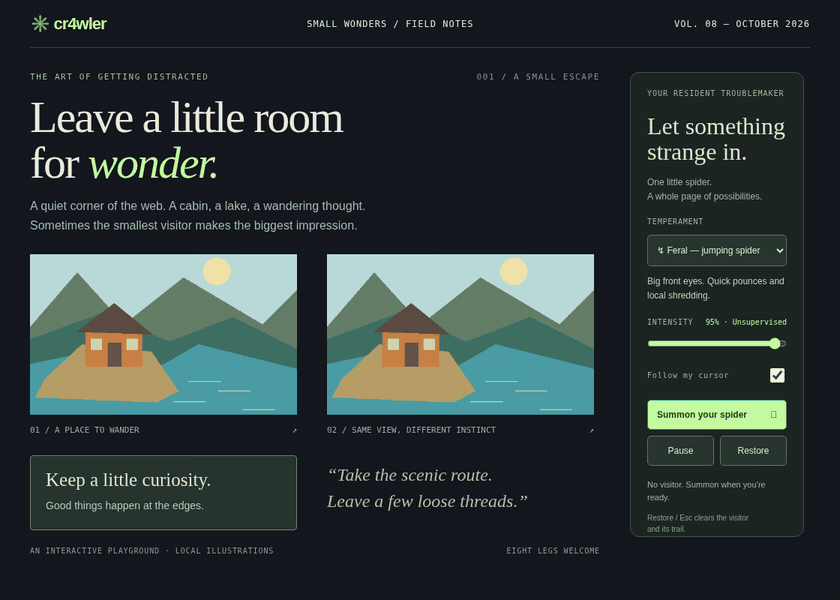

# cr4wler

A small Chrome extension that puts a neon spider on the page you're reading. It walks around and picks at elements. Add a little whimsey to your browsing. Press **Escape** to clear the mess and keep reading.

[](docs/cr4wler-demo.webm)

[Download v0.4.1](https://github.com/funsaized/cr4wler/releases/tag/v0.4.1) · [Changelog](CHANGELOG.md) · [Privacy](PRIVACY.md)

## Install

The Chrome Web Store submission is pending review. For now, this is an **experimental preview**: you'll need a Chrome profile that allows unpacked extensions.

1. Download [cr4wler-0.4.1.zip](https://github.com/funsaized/cr4wler/releases/download/v0.4.1/cr4wler-0.4.1.zip) and extract it into a folder you will keep. Choose this asset, rather than GitHub's source-code archives. No build tools are needed.
2. Open `chrome://extensions`, turn on **Developer mode**, click **Load unpacked**, and select the extracted folder containing `manifest.json`.
3. Open a website, click cr4wler in the toolbar, then **Summon your spider**. The popup closes once the spider launches. Reopen it to change settings, or use the little dock on the page.

Chrome's own pages and other restricted pages won't work. If a launch fails, the popup stays open with guidance so you can retry.

To verify the download, grab [cr4wler-0.4.1.zip.sha256](https://github.com/funsaized/cr4wler/releases/download/v0.4.1/cr4wler-0.4.1.zip.sha256) too. In the folder with both files, run `sha256sum -c cr4wler-0.4.1.zip.sha256` on Linux, or `shasum -a 256 -c cr4wler-0.4.1.zip.sha256` on macOS.

### Updating

Restore active sessions and close those tabs. Replace the contents of your existing extension folder with the new ZIP's contents, click **Reload** on its card in `chrome://extensions`, then reopen or refresh website tabs before summoning again. Keep the same folder and extension ID to retain preferences. The changed-bundle update path still needs a check in a normal browser profile; see the limits below.

<a id="a-small-set-of-controls"></a>

## Controls

- **Temperament:** Curious is a long-legged widow with precise bites. Dreamy is a rounded orb-weaver that moves slowly and peels gently. Feral is a jumping spider with quick pounces and shredding.
- **Intensity:** how hard the next effects hit.
- **Follow my cursor:** hover near something to guide the next hunt. Move away to change its mind. The spider never clicks a page control.
- **Pause / Resume:** stops or continues the spider. Existing fragments stay in place while you scroll.
- **Restore / Escape:** removes the spider and its effects, preserving edits you or the page made during the visit.

With cursor follow on, hold the pointer near the top or bottom edge to scroll the nearest eligible container. Move toward the center to stop. Each visit stops after six seconds or 1,800px. To continue move again or guide your spider to leave and return. User actions (wheel, touch, keyboard and scrollbar) take priority.

With reduced motion enabled, the spider stays still and starts no new hunts or edge scrolling.

Settings are saved locally; each active tab keeps its own settings. Reloading or navigating a website clears its spider and trail, so summon again from the toolbar.

## Technically what is happening to the page?

The effects live in a Shadow DOM overlay. The extension doesn't rewrite the page's HTML or trigger its actions. Words tear into fragments, loaded same-origin pictures loosen into tiles, simple cards flex and thin rules recoil.

Forms, inputs, editors, dialogs, live regions, iframes and recognized sensitive widgets are skipped. Page subtree's can be excluded with `data-cr4wler-ignore`. Plain buttons outside forms may get hunted, but handlers are never invoked.

The only extension permissions are **`activeTab` and `scripting`**. You grant access to a tab by summoning from the toolbar. It has no permanent host permissions, runtime network services, trackers or telemetry. Text and sampled pixels stay in document memory; it writes no storage on visited sites. [Privacy details](PRIVACY.md).

## Build and try it locally

You'll need Node.js 22.12+ and npm. Check out the tag for the published version, or use `main` for development:

```sh
git clone --branch v0.4.1 https://github.com/funsaized/cr4wler.git
cd cr4wler
npm ci
npm run build
```

Load `dist/` unpacked to use the extension. The popup also links to a bundled playground and light/dark stress pages. To run the standalone playground:

```sh
npm run dev
# http://127.0.0.1:4173
```

It uses the same engine and starts automatically. Add `?autostart=off` when you want to control startup yourself.

For development checks:

```sh
npx playwright install chromium
npm run typecheck
npm run lint
npm run format:check
npm test
npm run test:extension
# Native toolbar popup on headless Linux (requires Xvfb):
xvfb-run -a -s "-screen 0 1280x900x24" npm run test:popup
npm run package
```

Packaging needs Python 3 and writes the installable ZIP and SHA-256 checksum into `artifacts/`. With the same lockfile and toolchain, repeated builds produce the same ZIP. It includes the playground and synthetic fixtures.

The shared lifecycle is in `src/engine.ts`, the spider's anatomy and gait in `src/spider.ts`, and page discovery and geometry in `src/targets.ts` and `src/surfaces.ts`. [Contributing](CONTRIBUTING.md) covers the working conventions; [Testing](docs/TESTING.md) explains what each check covers.

## Inspiration

Inspiration behind the implementation: [rybinfx](https://x.com/rybinfx/status/2105700296760688790?s=20).
