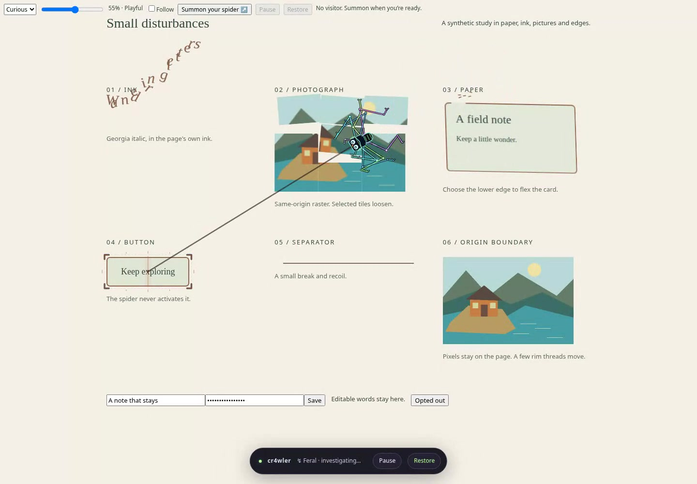

# cr4wler

**A tiny neon troublemaker for the open web.** Eight legs. Excellent taste. Questionable manners.

cr4wler is a Chrome extension that walks over a real page, hunts its typography and leaves a reversible trail of fragments. The page stays usable. **Escape** restores it immediately.

[](docs/cr4wler-demo.webm)

[Watch demo · 15.84s · normal speed](docs/cr4wler-demo.webm) · [Performance](docs/RUNTIME-PERFORMANCE.md) · [Privacy](PRIVACY.md) · [Testing](docs/TESTING.md) · [Contributing](CONTRIBUTING.md)

## Install

Requires Node.js 22.12+ and npm. Python 3 is needed to package a ZIP.

```sh
git clone https://github.com/funsaized/cr4wler.git
cd cr4wler
npm ci
npm run build
```

1. Open `chrome://extensions`, enable **Developer mode**, choose **Load unpacked**, and select `dist/`.
2. Open a regular website, click cr4wler in the toolbar, and choose **Summon your spider**. The popup closes after a successful launch; failures leave it open for retry.
3. Reopen the popup to change temperament, intensity or **Follow my cursor**. Use the floating dock or popup to Pause, Resume or Restore.

Local extensions must be allowed by your browser/profile. Restricted pages such as `chrome://` cannot host the effect. This extension has not been submitted to the Chrome Web Store.

The popup links to a bundled playground and light/dark stress pages. To run the standalone demo:

```sh
npm run dev
# http://127.0.0.1:4173
```

Both use the same engine. The demo starts automatically; extension use on other websites requires a toolbar action. `?autostart=off` disables demo startup for controlled checks.

## A small set of controls

- **Temperament:** Curious is a long-legged widow with precise bites; Dreamy is a rounded orb-weaver with slow steps and gentle peeling; Feral is a compact jumping spider with quick pounces and local shredding. Changing it updates the anatomy and next hunt without clearing the trail. A committed impact keeps its footprint.
- **Intensity:** changes the force of future effects.
- **Follow my cursor:** a stable hover guides the next hunt. Moving elsewhere cancels an uncommitted hunt; an impact already in progress finishes before the latest target takes over. Pointer jitter stays on the same target. It never activates a page control.
- **Pause / Resume:** freezes or continues motion and hunts. Existing marks stay anchored while you scroll.
- **Restore / Escape:** removes the visitor and its effects while preserving current page content, styles and user edits.

Hold the pointer near the top or bottom edge to crawl through the nearest eligible scroll container. Move toward the center to stop. Each visit stops after six seconds or 1,800px, at a maximum 440px/s; leave/re-enter or move again to continue. Wheel, touch, navigation keys, scrollbar use and external scrolling take priority and require fresh pointer movement before edge crawling resumes. Pause, blur, leaving, disabling follow and reduced motion stop scrolling. Recovery from rapid page movement never scrolls the page itself.

Touch users can operate the controls and scroll normally; cursor guidance needs a mouse or trackpad. A dismissible first-launch hint follows input capability and is remembered as shown. Reduced motion keeps a static visitor and disables new hunts and edge crawling.

| Boundary                            | Behavior                                                                                                                                                                                          |
| ----------------------------------- | ------------------------------------------------------------------------------------------------------------------------------------------------------------------------------------------------- |
| Reopen the popup                    | Shows this tab's live settings when active; otherwise saved next-launch preferences. Status checks keep it open.                                                                                  |
| Change settings                     | Saves temperament, intensity and follow preference on the extension/demo origin. Active tabs keep independent settings.                                                                           |
| Reload or navigate an extension tab | Clears that document's visitor and trail. Summon again through the toolbar. In-page route changes release changed/removed sources.                                                                |
| Demo reload or new page             | Starts with that origin's preferences unless `?autostart=off`. Restore stays off during bundle reentry and cached history returns. Cached active/paused returns retain intent with a fresh trail. |
| Extension update or browser restart | Preferences/hint survive with the same extension ID and profile data. Reload existing tabs after an update before summoning; no automatic reinjection.                                            |
| Clear origin data                   | Resets saved preferences and the hint. Activity, Pause, marks and page content are never saved.                                                                                                   |

The popup and bundled demo share the extension's origin data. A hosted demo has its own preferences. Injected content writes no visited-site storage.

## Page effects and safety

The spider plants feet on measured text and object edges, then notices, investigates, locks, prepares and strikes. Source-colored text tears at the claw; already-loaded same-origin raster images loosen into tiles; simple cards/buttons flex; thin rules recoil. Marks retain their identity as you scroll away and return. Removed, edited, hidden or newly ineligible sources release their effects.

A fixed Shadow DOM overlay holds the fragments; page HTML is never cloned. Forms, inputs, editors, submitters, dialogs, live regions, iframes and recognized sensitive widgets are excluded. Authors can exclude a subtree with `data-cr4wler-ignore`. Plain buttons outside forms may receive an inert visual treatment, without invoking their handlers. Sensitive-widget recognition is conservative and cannot identify every private page.

Cross-origin images, unsupported paint and exhausted bitmap budgets use an outline treatment. No image is fetched for an effect. There are no runtime dependencies, network services, trackers or telemetry; text and sampled pixels stay in document memory. See [Privacy](PRIVACY.md).

## Development

```sh
npx playwright install chromium
npm run typecheck
npm run lint
npm run format:check
npm test
npm run test:extension
# Headless Linux needs Xvfb for the native toolbar popup:
xvfb-run -a -s "-screen 0 1280x900x24" npm run test:popup
npm run package
```

The package command creates a versioned ZIP and SHA-256 digest under ignored `artifacts/`. Sorted entries, fixed timestamps and modes make repeated builds byte-identical with the same lockfile and toolchain. Unzip before **Load unpacked**. Build output includes the synthetic fixtures used by browser checks and the bundled demos.

`npm test` covers real Chromium behavior, geometry and mocked Chrome messaging. Installation, real permissions, material pixels and native-popup behavior have separate checks. See [Testing](docs/TESTING.md) for their scope and remaining compatibility limits.

| Source                                                | Responsibility                                         |
| ----------------------------------------------------- | ------------------------------------------------------ |
| `src/engine.ts`                                       | Lifecycle, hunts, persistent marks and restoration     |
| `src/spider.ts`                                       | Anatomy, gait, inverse kinematics and Canvas rendering |
| `src/targets.ts`, `src/surfaces.ts`                   | Bounded discovery and safe page geometry               |
| `src/materials.ts`, `src/effects.ts`                  | Snapshots, fragment treatments and projections         |
| `src/content.ts`, `src/popup.ts`, `src/playground.ts` | Extension activation and shared controls               |

Discovery uses viewport hit tests and a progressive document cursor, bounded to 1,800 visited nodes and 80 useful ranges per pass in roughly 2ms slices. Geometry is acquired and invalidated by page changes, with throttled safety refreshes. A session retains at most **512 records**, **72 DOM projections**, **16 shards per record** and **1,048,576 snapshot pixels**. Excess visible settled marks share one canvas; reaching the record cap stops new hunts and asks for Restore. Marks are never silently evicted. Device pixel ratio is capped at 2; Pause and hidden tabs stop hunting.

Measured surface CPU work improved by 35–43%, but dense mixed-frame tails remain around 100ms on the tested SwiftShader executor. This is not a 60 FPS claim. See [Performance](docs/RUNTIME-PERFORMANCE.md) for reproduction and limits.
