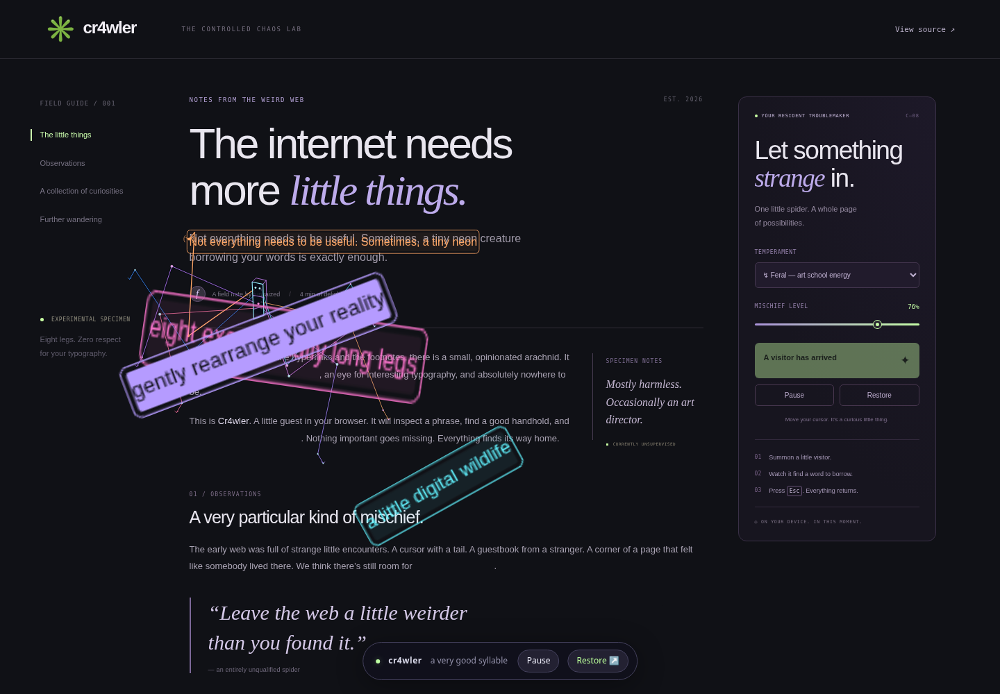

# cr4wler

**A tiny neon troublemaker for the open web.** Eight legs. Excellent taste. Questionable manners.

cr4wler is a Chrome extension proof of concept that climbs over a real page, scans a phrase with a head-mounted beam, locks onto it, and pulls its typography apart. A persistent composition accumulates as you scroll. The original page stays in place. Press **Escape** and everything returns immediately.



[Watch the captured browser demo](docs/demo.webm) · [Privacy](PRIVACY.md) · [Testing and limitations](docs/TESTING.md) · [Contributing](CONTRIBUTING.md)

## Try it

Requires Node.js 22+ and npm. Python 3 is needed only to package the ZIP.

```sh
git clone https://github.com/funsaized/cr4wler.git
cd cr4wler
npm ci
npm run build
```

1. Open `chrome://extensions` in a Chrome profile where local extensions are allowed.
2. Turn on **Developer mode**, choose **Load unpacked**, and select this project's `dist/` directory.
3. Open a regular website, click cr4wler in the extension toolbar, and choose **Summon your spider**.
4. Try Curious, Dreamy, or Feral. Use the mischief slider to change the force of the typographic effects. Enable **Follow my cursor** to guide its exploration.
5. Pause from the popup or floating dock. **Reset page** or **Escape** removes the visitor and every fragment.

The popup's **Try the playground** link opens the bundled night garden. Its **Daylight stress test** link opens an ordinary light document with 1,800 fictional references across 60 sections. For the standalone version:

```sh
npm run dev
# http://127.0.0.1:4173
```

The playground runs the same animation and interaction engine directly. It does not require extension installation and is not evidence that extension permissions work.

## What makes it move

- Eight planted feet, analytic inverse kinematics, articulated knees and feet, crisp neon leg cores, luminous active joints, and a narrow braced wireframe body. All procedural; no animated images or external assets.
- Silk arrival and spring-driven movement. The head points toward a live target; a sweeping selector settles into a lock box, pauses in anticipation, then strikes. A gripping front leg follows the contact point during peeling and shearing.
- Five rotating effects: peeling phrases, skewed shear, scattered glyph groups, staggered disassembly, and ragged erasure trails. Original text is visually masked; colored inert shards form the aftermath.
- Every committed mark keeps its identity, color, and displacement as you scroll away and return. Reflow updates its anchor to the original live range. Nothing times out. Reset, Escape, or refresh clears the whole composition.
- Optional cursor following approaches with a comfortable stand-off and biases the next target toward your pointer. A committed lock or strike finishes before the next destination is chosen.
- Small moving selector accents and low-contrast local pulses; no full-page flashes or high-contrast strobing. Reduced motion shows a still visitor, disables scanning/strikes and retains existing aftermath without continuous animation.

## A guest, not a wrecking ball

Only `activeTab` and `scripting` are requested. No host permissions or automatic content scripts. A toolbar gesture grants access to the current tab; Summon injects a single controller into its main frame.

The controller adds a fixed Shadow DOM overlay. It copies **text only**, never HTML, scripts, buttons, images, or embedded content. CSS Custom Highlights temporarily paint the source ranges transparent. The source text, attributes, event handlers, input values, and layout are never rewritten. Restoration deletes only cr4wler's own highlight entry and overlay. Existing highlights and page edits are preserved.

Inputs, forms, buttons, editors, dialogs, embedded frames, hidden content, live regions, and conservatively recognized payment/authentication/private widgets are excluded. Authors can also opt out any subtree with `data-cr4wler-ignore`. This is a visual POC, not a sensitive-data classifier: don't summon it on pages you do not want animated.

Nothing is clicked, submitted, fetched, uploaded, or stored. All fragment text lives only in this page's memory while the effect is active. There are no runtime dependencies, trackers, telemetry, fonts from CDNs, or remote services. See [PRIVACY.md](PRIVACY.md).

## Development

```sh
npm run typecheck
npx playwright install chromium
npm test
npm run test:extension
npm run package
```

`npm test` runs real Chromium DOM/interaction tests, a packaged content-script harness with mocked messaging, and popup tests with mocked Chrome APIs. `test:extension` separately loads the actual extension, verifies denial before a gesture, triggers Chrome’s toolbar action, and exercises the real popup page and isolated-world controller with unmodified permissions and real Chrome APIs. It records a video and screenshot and fails loudly if browser policy blocks installation. See [the validation record](docs/TESTING.md), including the remaining manual compatibility checklist.

`npm run package` creates `artifacts/cr4wler-0.2.0.zip` and its SHA-256 digest. ZIP entry order, timestamps, and modes are fixed. With the lockfile and the same toolchain, repeated builds produce identical bytes. Unzip before selecting **Load unpacked**. This has not been submitted to the Chrome Web Store.

Useful files:

| File                | Responsibility                                             |
| ------------------- | ---------------------------------------------------------- |
| `src/spider.ts`     | Procedural gait, IK, canvas rendering, silk and grip       |
| `src/targets.ts`    | Pruned and bounded safe text scanning                      |
| `src/engine.ts`     | Hunt sequence, persistent records, virtualization and undo |
| `src/effects.ts`    | Seeded fragment treatments and bounded projections         |
| `src/content.ts`    | Idempotent isolated-world message controller               |
| `src/popup.ts`      | Explicit per-tab activation and settings                   |
| `src/playground.ts` | Standalone demo controls                                   |

Discovery combines viewport hit testing with a progressive document cursor. Each pass is bounded to 1,800 visited nodes and 80 useful ranges, in roughly 2 ms slices, so deep reference sections can be reached without rescanning an entire document each frame. Layout is read on acquisition and coalesced scroll/resize/content events, not on every animation frame.

A session keeps up to **512 persistent records** and at most **72 DOM projections**, each with no more than 16 shards. Offscreen records retain their source ranges and transforms without mounted DOM. If reflow makes more than 72 records visible together, the excess settled marks use one shared canvas. At 512 marks the spider stops making new ones and explicitly asks for Reset; it never silently evicts old visible aftermath. A source removed, changed, hidden, or made ineligible by its page is safely released rather than overwriting that page's edits.

Device pixel ratio is capped at 2. Hunting stops when paused or the tab is hidden. Paused marks still follow document scrolling and reflow. No particles are allocated, and no record survives a page refresh.

## POC boundaries

Protected browser pages, the Chrome Web Store, PDFs, and other extensions' pages cannot be scripted. The built-in playground has its own direct engine. Shadow roots and iframes are deliberately not traversed. CSS-transformed pages, hostile page styles, unusual vertical text, animated layouts, extreme zoom, and live collaborative editors need broader compatibility work. Discovery is incremental and does not promise to visit every eligible phrase. Settings are deliberately ephemeral and reset when the popup is reopened without an active visitor.

Motion inspiration: [the reference by @rybinfx](https://x.com/rybinfx/status/2105700296760688790), viewed and analyzed before implementation. All code, procedural motion, visual assets, and playground copy here are original; no video, artwork, or source code was copied. This project is unaffiliated with that creator.

MIT licensed, made for **funsaized**. Contributions with fewer legs are also welcome.
